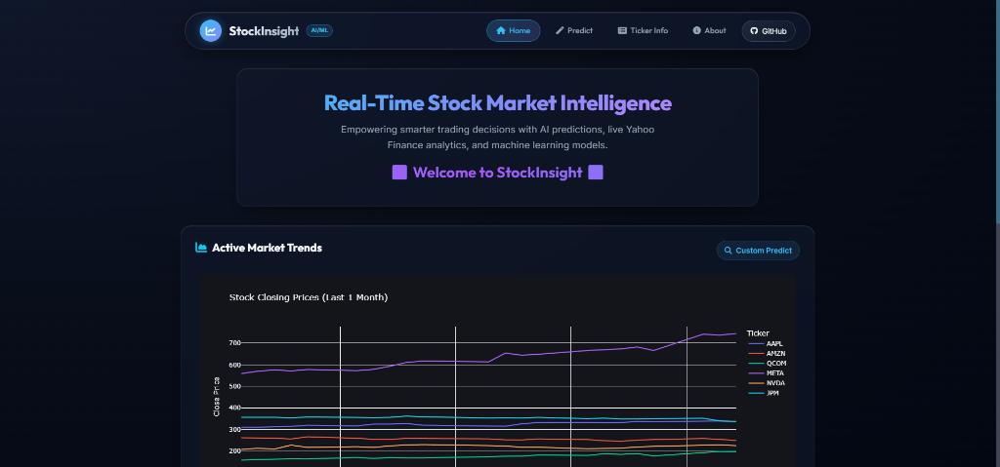
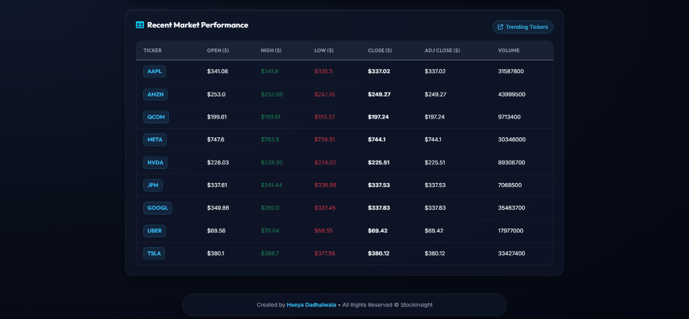
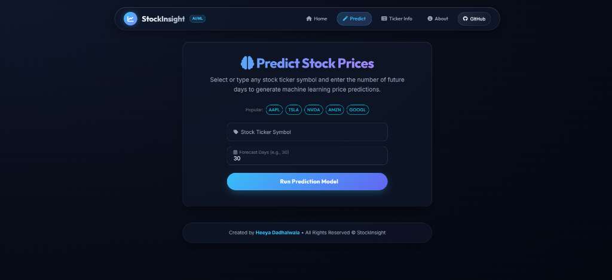
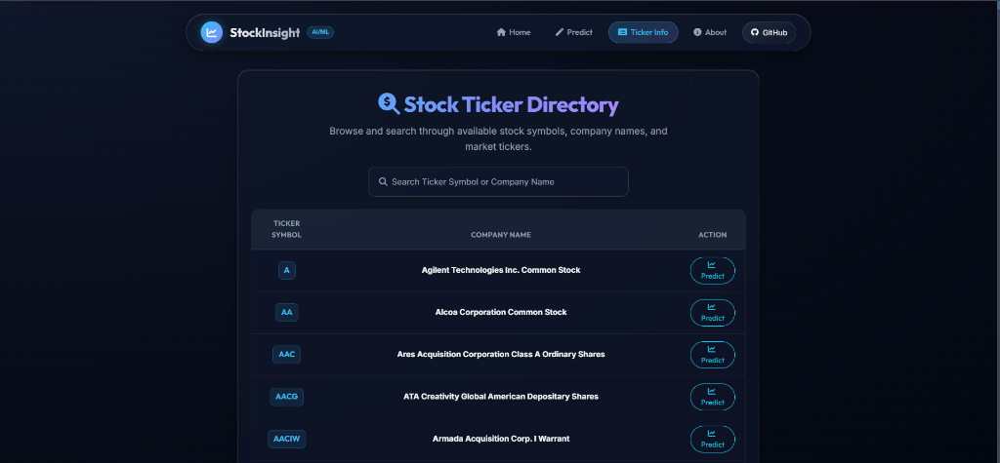
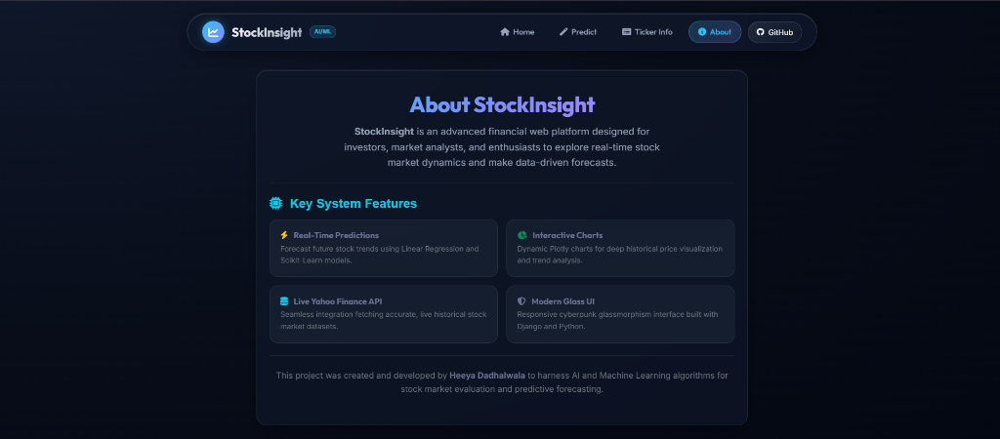

# Stock Market Prediction with Machine Learning and Django

A web application that predicts live stock prices in the American market using machine learning algorithms and data retrieved from the Yahoo Finance API. This project combines the power of Python, Django, and machine learning to provide users with accurate stock price forecasts and insightful trend analysis.

---

## 📸 Application Screenshots

### 1. Home Page - Active Market Trends


***

### 2. Home Page - Recent Market Performance


***

### 3. Predict Stock Prices Page


***

### 4. Stock Ticker Directory Page


***

### 5. About StockInsight Page


---

## Features

- **Live Stock Data**: Fetches real-time stock market data from Yahoo Finance API.
- **Stock Price Prediction**: Utilizes machine learning models to predict future stock prices based on historical data.
- **Interactive Visualizations**: Provides graphical representations of stock trends using Plotly.
- **Modern Glassmorphism UI**: High quality, responsive cyberpunk dark mode interface built with Django templates.

---

## Technologies Used

- **Backend**: Django (Python framework)
- **Machine Learning**: Python libraries such as Scikit-learn, Pandas, and NumPy
- **API Integration**: Yahoo Finance API (`yfinance`) for real-time data
- **Visualization**: Plotly for interactive graphical analysis
- **Database**: SQLite (default Django database)
- **Frontend**: HTML5, CSS3 Glassmorphism, Bootstrap 5, Font Awesome, JavaScript

---

## Installation and Setup

### Prerequisites
- Python 3.x
- pip (Python package manager)
- Git

### Steps to Run the Project

1. **Clone the Repository**
   ```bash
   git clone https://github.com/heeya2704/Stock_market_prediction_ML.git
   cd Stock_market_prediction_ML
   ```

2. **Set Up a Virtual Environment**
   ```bash
   python -m venv venv
   source venv/bin/activate  # On Windows: venv\Scripts\activate
   ```

3. **Install Dependencies**
   ```bash
   pip install -r requirements.txt
   ```

4. **Run Migrations**
   ```bash
   python manage.py migrate
   ```

5. **Start the Development Server**
   ```bash
   python manage.py runserver
   ```

6. **Access the Application**
   Open your web browser and navigate to `http://127.0.0.1:8000/`.

---

## Usage

1. Search for a specific stock symbol on the **Predict** page.
2. View live stock prices and historical trends fetched from Yahoo Finance.
3. Analyze predicted stock prices based on historical trends.
4. Explore interactive visualizations to make informed decisions.

---

## Author

- **Heeya Dadhalwala**  
  *Founder and Owner of StockInsight*
